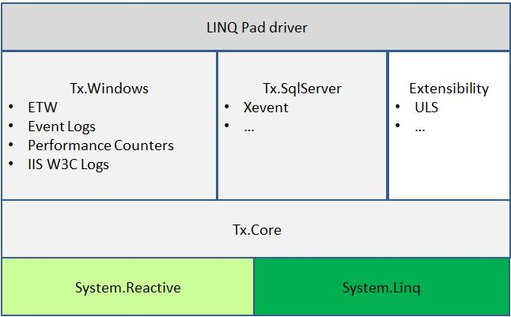

# Tx (LINQ to Logs and Traces)
 
Tx allows you to do Language Integrated Query (LINQ) directly on raw event sources:

- ad-hoc query on past history in trace and log files
- standing queries on real-time feeds, such as Event Tracing for Windows (ETW) sessions

The Tx approach is different than Databases, Hadoop, Splunk, Dapper, etc. which all require a stage of uploading before the events become available to queries.

Instead, mixing Reactive Extensions (Rx) and LINQ-to-Objects allows the query to be embedded anywhere including:

- In light-weight UI tools like [LINQPad](Source/Tx.LinqPad/Readme.md)  and [SvcPerf](http://svcperf.codeplex.com)
- On original source machines, such as [Synthetic Counters](Samples/SyntheticCounters/readme.md)

The following picture shows the dependencies among the main Tx components:

Here:

- Dark green is .Net
- Light green is mature open source
- Light grey are framework components, also available on NuGet
- Darker gray are tool experiences that come with Tx
- White are samples

For more see the [documentation](Doc\Readme.md)

## Contribute

There are lots of ways to [contribute](https://tx.codeplex.com/wikipage?title=Contributing) to the project, and we appreciate our [contributors](Contributors.txt).

You can contribute by reviewing and sending feedback on code checkins, suggesting and trying out new features as they are implemented, submit bugs and help us verify fixes as they are checked in, as well as submit code fixes or code contributions of your own. Note that all code submissions will be rigorously reviewed and tested by the Rx Team, and only those that meet an extremely high bar for both quality and design/roadmap appropriateness will be merged into the source.

You will need to sign a Contributor License Agreement before submitting your pull request. To complete the Contributor License Agreement (CLA), you will need to submit a request via the form (select "Reactive Extensions") and then electronically sign the Contributor License Agreement when you receive the email containing the link to the document. This needs to only be done once for any Microsoft Open Technologies OSS project.

