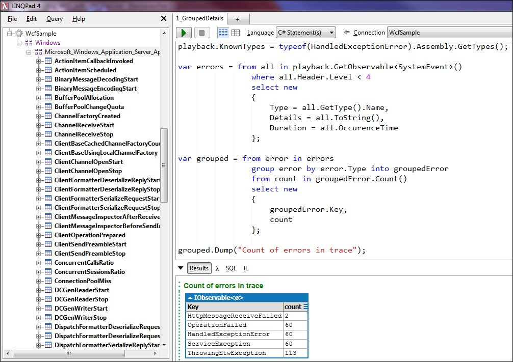
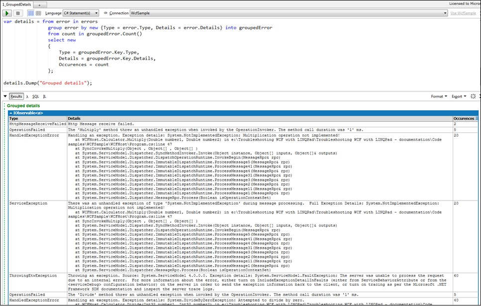
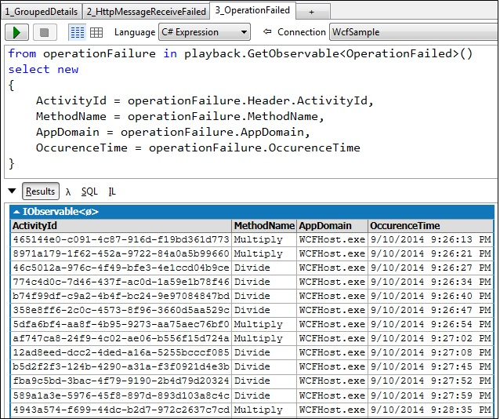
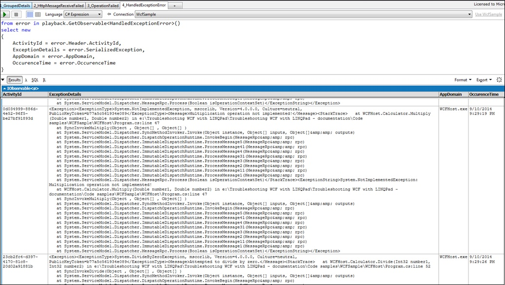
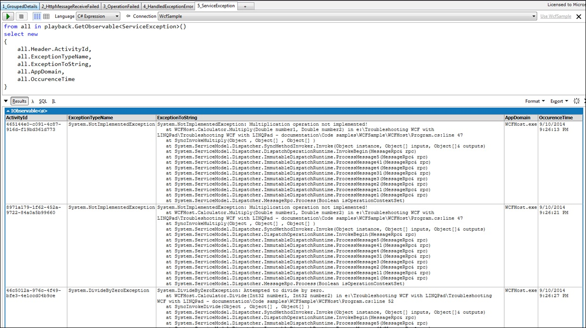
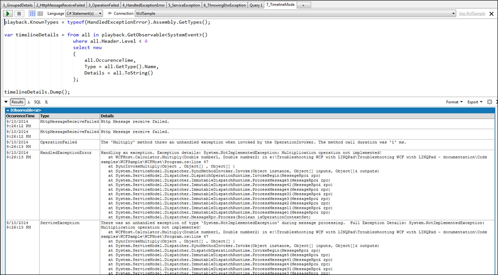

# Troubleshooting WCF with LINQPad #

> By Swetha Machanavajhala

----------

### The evolution of WCF troubleshooting

In.Net 2.0, WCF shipped a story that relied on tracing in XML with extension .svclog. This worked great on small projects allowing people to use the [TraceViewer](http://msdn.microsoft.com/en-us/library/aa751795(v=vs.110).aspx). Unfortunately, for production environments:

* The traces quickly grow to GB and TB. Sending them to ETW helps with performance impact but not the file size (now there is XML in ETW)
* The TraceViewer tool becomes un-responsive or runs out of memory

In .Net 4.5 the entire tracing of WCF was rewritten to use approach similar to [EventSource](http://blogs.msdn.com/b/vancem/archive/2012/07/09/logging-your-own-etw-events-in-c-system-diagnostics-tracing-eventsource.aspx). Also, Sajay Anthony from Azure Fundamentals built a next generation tool [SvcPerf](http://svcperf.codeplex.com/) which replaces the TraceViewer. 

With this change, the tracing for WCF in .Net 4.5 becomes from worse to best:

* Structured, Manifested like the kernel components
* Best usage of correlation discipline - Activity ID-s, Transfers and correlation tokens (the SOAP Message ID)

In this paper we illustrate how to use LINQ to Logs and Traces to troubleshoot WCF. This is useful to understand the underlying infrastructure below SvcPerf. Finally we will give some guidance when to use [Tx in LINQPad](../../../../Source/Tx.LinqPad/Readme.md) and when to use SvcPerf.

### Creating ETL trace for WCF

Refer the article [How do I collect an ETL trace for WF/WCF?](http://svcperf.codeplex.com/wikipage?title=How%20do%20I%20collect%20an%20ETL%20trace%20for%20WF%2fWCF%3f&referringTitle=FAQs) for the commands.

### Sample WCF application

Two console applications, [WcfHost](../../../WcfTroubleshooting/WCFHost/Program.cs) and [WcfClient](../../../WcfTroubleshooting/WCFClient/Program.cs) were created where the client communicates with the host to perform simple calculator functions. 

The main goal is to be able to find the cause of error when the connection is broken between client and server. In this sample application, the server-client connection was broken in the following ways:

- Used a wrong base address when generating files needed for client
- Client attempted to divide by zero

Let us see in the following sections how to troubleshoot the problems caused by the above two conditions.

#### 1. Run the batch file

Make sure to change the drive in the following batch files according to the drive in your system:

1. [WcfSampleTraceScript.bat](../../../WcfTroubleshooting/Scripts/WcfSampleTraceScript.bat)
2. [InvokeWcf.bat](../../../WcfTroubleshooting/Scripts/InvokeWcf.bat)

Run WcfSampleTraceScript.bat  

### Querying the ETL trace in LINQPad

Once the ETL trace is created, the next step is to view the details in LINQPad using Tx driver.

New to LINQPad and Tx driver? Refer this [wiki on LINQPad driver for Tx](../../../../Source/Tx.LinqPad/Readme.md).

After setting up the LINQPad and Tx driver,

- Step 1: [GroupedDetails query](1_GroupedDetails.linq)
-

Notice the populated tree on the left pane. These are different events logged in the trace.

Firstly, we want to find the errors and count. The events with level less than 4 are logged as errors so we query based on this condition. 

Now, we know that errors were logged in these events. We can then try grouping the details to see what error has been thrown.

- Step 2: [HttpMessageReceivedFailed query](2_HttpMessageReceiveFailed.linq)
- 

Next, we may want to see the full details on each of the events that logged errors. This is an example of structured model that LINQPad uses to show details about a particular event. Check below screen-shots.

- [OperationFailed query](3_OperationFailed.linq)
-

- [HandledExceptionError query](4_HandledExceptionError.linq)
-

- [ServiceException query](5_ServiceException.linq)
-

- Step 3: [TimelineMode query](7_TimelineMode.linq)
-

Finally, the logged errors can be viewed in a timeline fashion.

### When to use Tx via LINQPad and when to use SvcPerf

What we have seen from practice is that:

* The default view of SvcPerf loads events in-memory. So if the trace is really huge LINQPad is better choice. We are working with Sajay to fix this.
* For traces like this, make sure that you use Rx query first to reduce the volume. Use LINQ to Objects only on output of Rx, or mixed into places that work on collections of small size (e.g. Buffer)
* LINQPad is more appealing to expert developers. SvcPerf is best fitted for people that are used to UI tools or text editors
* A feature that makes SvcPerf really appealing is the templates. 

Typically, people start with LINQPad and build their first few queries. Then they re-purpose the code as template in SvcPerf. This allows few people to write LINQ and many less sophisticated users to use them. 